# Assignment 1 (undergrad) submission

### Date: 10/19/2025

## Install Dependencies 
  `pip install -r requirements.txt`

## Task 1 Submission 

* model summary by calling model.summary()
* The confusion matrix
* The classification report on test dataset

These are given at the end of the part 1 notebook. 

### The train vs val loss plot
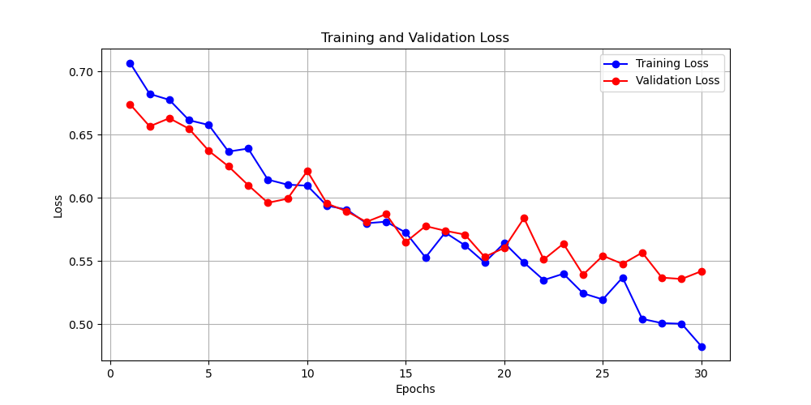

### The accuracy plot 
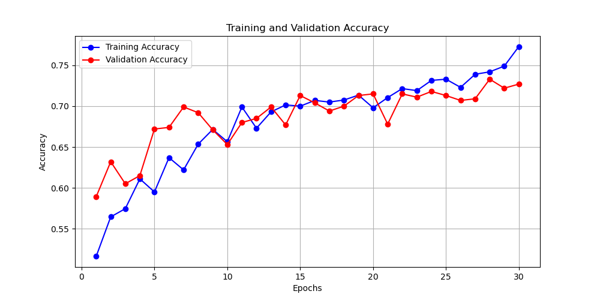

## Task 2 Submission 
* submit the accuracy score with at least 3 different occlusion masks and heatmap plot for each mask

### Heatmaps for the three different occlusion masks with accuracy 71%
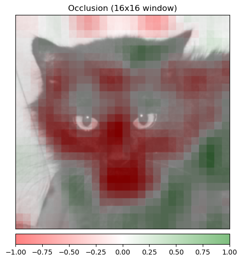
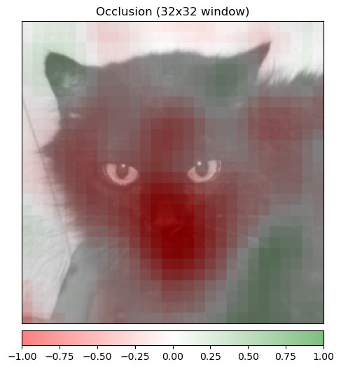
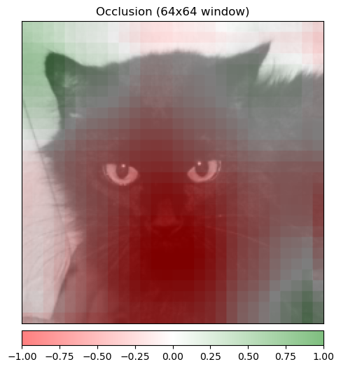

## Task 3 submission

### Accuracy scores for 3 different epsilon values 
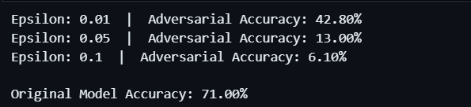

### adversarial images for each epsilon value
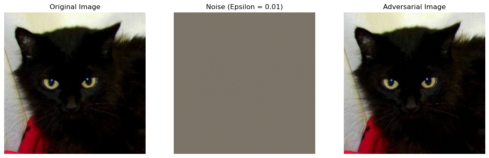
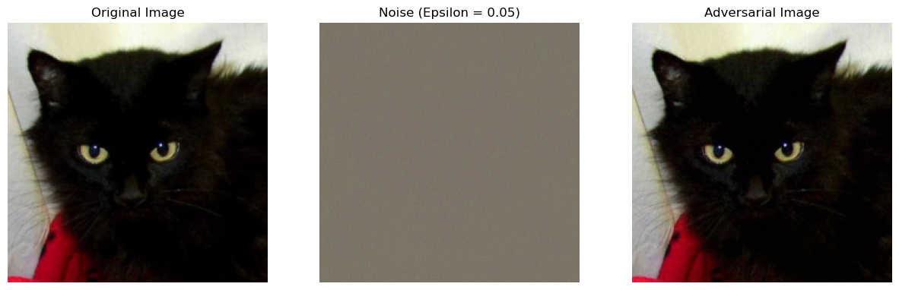
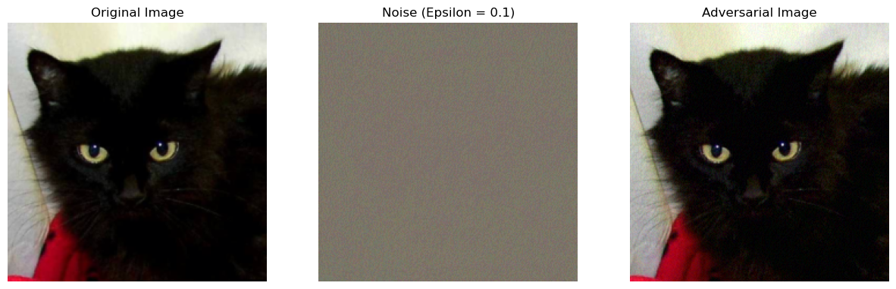

## Task 4 submission
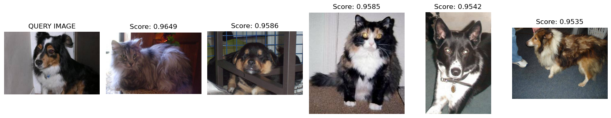
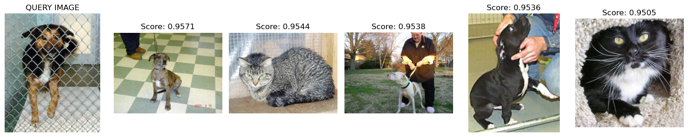
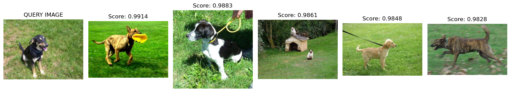